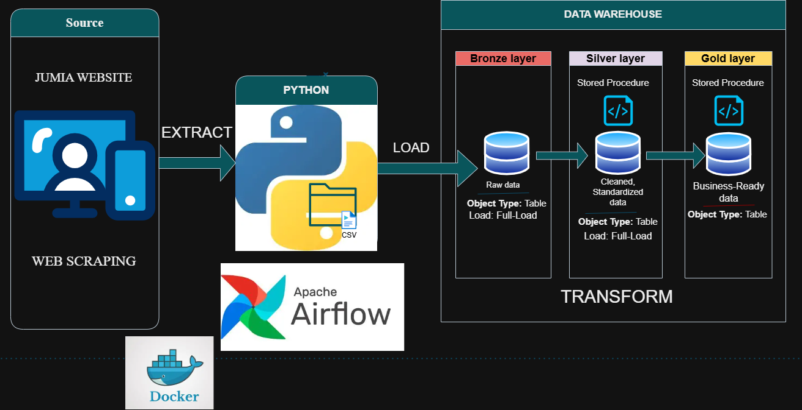
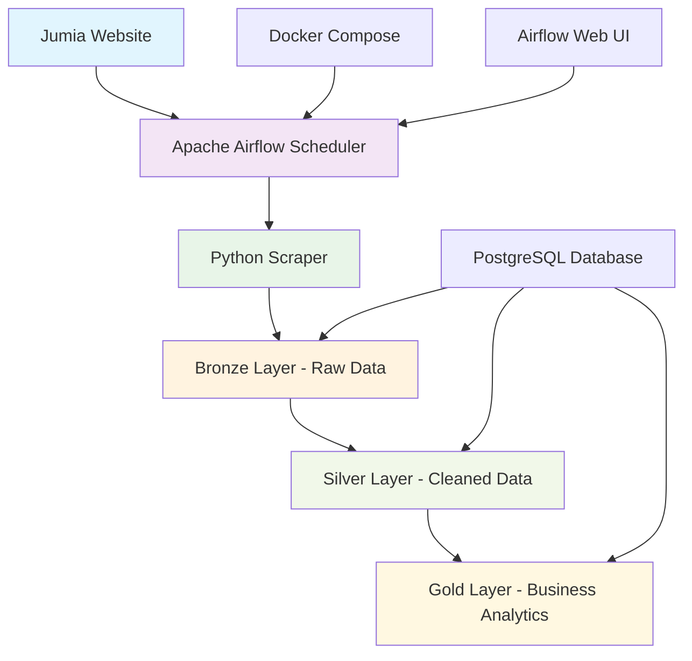
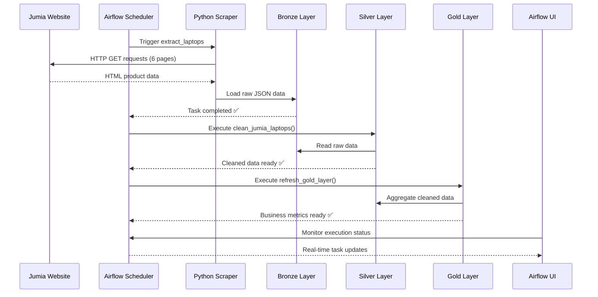

# 🚀 Jumia ELT Data Pipeline

[](https://airflow.apache.org/)
[](https://www.postgresql.org/)
[](https://www.docker.com/)
[](https://www.python.org/)
[](https://opensource.org/licenses/MIT)

<div align="center">
  
  <p><em>Professional Apache Airflow Dashboard - Production Ready ELT Pipeline</em></p>
</div>

## 📊 Executive Summary

This repository contains a **production-grade ELT (Extract, Load, Transform) data pipeline** built with Apache Airflow, designed to extract laptop product data from Jumia Kenya and process it through a sophisticated medallion architecture. The pipeline demonstrates enterprise-level data engineering practices with proper orchestration, monitoring, and scalability.

### 🎯 Key Features

- ✅ **Enterprise Architecture**: Medallion data lakehouse pattern (Bronze → Silver → Gold)
- ✅ **Production Orchestration**: Apache Airflow with LocalExecutor for reliable scheduling
- ✅ **Containerized Deployment**: Docker Compose for consistent environments
- ✅ **Comprehensive Monitoring**: Full observability with Airflow UI and logging
- ✅ **Security First**: Environment-based credential management
- ✅ **Scalable Design**: Easily extendable for additional data sources

## 🏗️ System Architecture

<div align="center">
  
  <p><em>Complete ELT Pipeline Architecture - Medallion Data Lakehouse Pattern</em></p>
</div>

### 📐 Architecture Components



#### 🔄 Data Flow Process

1. **🕷️ Web Scraping Layer**: Beautiful Soup extracts structured data from Jumia Kenya
2. **🥉 Bronze Layer**: Raw, unprocessed data stored with full fidelity
3. **🥈 Silver Layer**: Cleaned, validated, and standardized data via SQL procedures
4. **🥇 Gold Layer**: Business-ready aggregated metrics and analytics
5. **📊 Orchestration**: Airflow manages dependencies, retries, and monitoring

### 🛠️ Technology Stack

| Component | Technology | Purpose |
|-----------|------------|---------|
| **Orchestration** | Apache Airflow 2.7.1 | Workflow management and scheduling |
| **Database** | PostgreSQL 13 | Data persistence and SQL transformations |
| **Containerization** | Docker + Docker Compose | Environment consistency and deployment |
| **Web Scraping** | Beautiful Soup + Requests | Data extraction from web sources |
| **Data Processing** | Pandas + Python | Data manipulation and analysis |
| **Monitoring** | Airflow UI + Logs | Pipeline observability and debugging |

## � Quick Start Guide

### �📋 Prerequisites

Ensure you have the following installed and configured:

- ✅ **Docker Desktop** (Windows/Mac) or Docker Engine (Linux)
- ✅ **Docker Compose** v3.8+
- ✅ **Existing PostgreSQL Database** with:
  - `bronze` schema for raw data storage
  - `silver` schema with `clean_jumia_laptops()` stored procedure  
  - `gold` schema with `refresh_gold_layer()` stored procedure
- ✅ **Git** for repository management

### ⚡ Installation & Setup

<div align="center">
  
</div>

#### 1️⃣ Clone Repository
```bash
git clone https://github.com/Peter-Opapa/jumia-elt-airflow-docker.git
cd jumia-elt-airflow-docker
```

#### 2️⃣ Environment Configuration
```bash
# Copy environment template
cp .env.template .env

# Edit .env with your database credentials
# Windows: notepad .env
# Linux/Mac: nano .env
```

**📝 Required Environment Variables:**
```bash
# Airflow Configuration
AIRFLOW_UID=50000
AIRFLOW_USER=admin
AIRFLOW_PASSWORD=admin

# Your Existing PostgreSQL Database
DB_HOST=host.docker.internal    # For Docker to host communication
DB_PORT=5432
DB_NAME=jumia_db
DB_USER=postgres
DB_PASSWORD=your_actual_password  # ⚠️ Replace with real password

# Pipeline Settings
MAX_PAGES=6
DELAY_BETWEEN_REQUESTS=1
LOG_LEVEL=INFO
```

> 🔒 **Security Note**: The `.env` file is automatically gitignored to protect your credentials.

#### 3️⃣ Launch Pipeline
```bash
# Windows PowerShell
.\start.ps1

# Alternative: Manual startup
cd docker
docker compose up -d
```

#### 4️⃣ Access Airflow Dashboard
- 🌐 **URL**: http://localhost:8080
- 👤 **Username**: `admin`
- 🔑 **Password**: `admin`

<div align="center">
  
  <p><em>Airflow Web UI Login Screen</em></p>
</div>

#### 5️⃣ Execute Pipeline
1. Navigate to **"jumia_elt_pipeline"** DAG
2. Toggle the DAG **ON** (activate)
3. Click **"Trigger DAG"** for immediate execution
4. Monitor progress in real-time

<div align="center">
  
  <p><em>Live DAG Execution Monitoring</em></p>
</div>

## 📁 Project Structure

```
jumia-elt-airflow-docker/
├── 📁 airflow/                     # Apache Airflow configuration
│   ├── 📁 dags/
│   │   └── 📄 jumia_elt_dag.py     # 🎯 Main orchestration DAG
│   ├── 📁 logs/                    # 📊 Execution logs (auto-created)
│   └── 📁 plugins/                 # 🔌 Custom Airflow plugins (auto-created)
├── 📁 src/
│   └── 📄 jumia_pipeline.py        # 🐍 Core ELT business logic
├── 📁 docker/
│   └── 📄 docker-compose.yaml      # 🐳 Production containerization
├── 📁 sql/                         # 💾 Database schemas and procedures
│   ├── 📄 bronze_schema.sql        # Raw data tables
│   ├── 📄 silver_procedures.sql    # Data cleaning logic
│   └── 📄 gold_procedures.sql      # Business aggregations
├── 📁 docs/                        # 📚 Documentation and images
│   ├── 📄 DEPLOYMENT.md            # Production deployment guide
│   ├── 📄 API_REFERENCE.md         # Function documentation
│   └── 📁 images/                  # Architecture diagrams
├── 📄 .env                         # 🔐 Environment variables (gitignored)
├── 📄 .env.template                # 📝 Environment template for setup
├── 📄 .gitignore                   # 🚫 Git exclusions for security
├── 📄 start.ps1                    # ⚡ Windows quick start script
├── 📄 SECURITY_SETUP.md            # 🛡️ Security best practices
├── 📄 CI_CD_SETUP.md               # 🚀 CI/CD implementation guide
└── 📄 README.md                    # 📖 This comprehensive documentation
```

### 🗂️ Core Files Explained

| File | Purpose | Key Features |
|------|---------|--------------|
| `jumia_elt_dag.py` | Airflow workflow definition | Task dependencies, scheduling, error handling |
| `jumia_pipeline.py` | Business logic implementation | Web scraping, database operations, data processing |
| `docker-compose.yaml` | Infrastructure as code | Service definitions, networking, volume management |
| `.env.template` | Configuration template | Secure credential management, environment portability |

## 🔧 Configuration

### Environment Variables (.env)

```bash
# Airflow Settings
AIRFLOW_UID=50000
AIRFLOW_USER=admin
AIRFLOW_PASSWORD=admin

# Your Existing Database
DB_HOST=host.docker.internal  # For Docker to host communication
DB_PORT=5432
DB_NAME=jumia_db
DB_USER=postgres
DB_PASSWORD=your_actual_password

# Pipeline Settings
MAX_PAGES=6
DELAY_BETWEEN_REQUESTS=1
```

## 🔄 Pipeline Deep Dive

<div align="center">
  
  <p><em>End-to-End Data Flow with Processing Details</em></p>
</div>

### 📊 Data Flow Architecture



### 🎯 Airflow DAG Tasks

<div align="center">
  
  <p><em>Airflow DAG Graph - Task Dependencies and Flow</em></p>
</div>

| Task | Description | Duration | Dependencies |
|------|-------------|----------|--------------|
| **🕷️ extract_laptops** | Web scraping from Jumia (6 pages) | ~2-3 minutes | None (Start) |
| **📥 load_bronze** | Insert raw data into bronze.jumia_laptops | ~30 seconds | extract_laptops |
| **🔄 transform_silver** | Execute silver.clean_jumia_laptops() | ~1 minute | load_bronze |
| **📊 transform_gold** | Execute gold.refresh_gold_layer() | ~45 seconds | transform_silver |

### ⏰ Scheduling & Execution

- **📅 Schedule**: Daily at 6:00 AM UTC (`0 6 * * *`)
- **🔄 Retries**: 2 attempts with 5-minute intervals
- **⏱️ Timeout**: 30 minutes per task
- **🎯 Catchup**: Disabled for current data only
- **📈 SLA**: 45 minutes end-to-end execution

## 📊 Monitoring & Observability

<div align="center">
  
  <p><em>Comprehensive Monitoring Dashboard - Real-time Pipeline Health</em></p>
</div>

### 🎛️ Airflow UI Features

#### 📈 Dashboard Overview
- **Pipeline Health**: Real-time status of all DAG runs
- **Success Rate**: Historical success/failure metrics
- **Execution Times**: Performance trends and bottlenecks
- **Resource Usage**: CPU, memory, and database connections

#### 🔍 Detailed Monitoring Views

| View | Purpose | Key Metrics |
|------|---------|-------------|
| **Grid View** | Task execution timeline | Status, duration, retries |
| **Graph View** | Task dependencies | Data flow, bottlenecks |
| **Gantt Chart** | Performance analysis | Execution overlap, delays |
| **Task Logs** | Debugging and troubleshooting | Error messages, data quality |

<div align="center">
  
  <p><em>Gantt Chart - Performance Analysis and Optimization</em></p>
</div>

### 📋 Health Check Commands

```bash
# 🐳 Check Docker services status
docker compose ps

# 📊 View real-time Airflow logs
docker compose logs -f airflow-scheduler

# 🔍 Monitor specific task execution
docker compose logs airflow-webserver | grep "jumia_elt"

# 💾 Test database connectivity
docker compose exec airflow-webserver python -c "
import sys; sys.path.append('/opt/airflow/src')
from jumia_pipeline import get_db_connection
conn = get_db_connection()
print('✅ Database Connection: SUCCESS')
conn.close()
"

# 📈 Check data freshness
docker compose exec airflow-webserver python -c "
import sys; sys.path.append('/opt/airflow/src')
from jumia_pipeline import get_db_connection
import pandas as pd
conn = get_db_connection()
result = pd.read_sql('SELECT COUNT(*), MAX(created_at) FROM bronze.jumia_laptops', conn)
print(f'✅ Bronze Records: {result.iloc[0,0]}, Latest: {result.iloc[0,1]}')
conn.close()
"
```

### 📋 Data Quality Validation

```sql
-- 🥉 Bronze Layer Health Check
SELECT 
    COUNT(*) as total_records,
    COUNT(DISTINCT product_url) as unique_products,
    MAX(created_at) as last_update
FROM bronze.jumia_laptops;

-- 🥈 Silver Layer Validation  
SELECT 
    COUNT(*) as cleaned_records,
    AVG(price_ksh) as avg_price,
    COUNT(DISTINCT brand) as brands_count
FROM silver.processed_laptops 
WHERE created_at >= CURRENT_DATE;

-- 🥇 Gold Layer Business Metrics
SELECT 
    category,
    total_products,
    avg_price_ksh,
    last_updated
FROM gold.laptop_summary 
ORDER BY total_products DESC;
```

## 🛠️ Development & Maintenance

### 🚀 Contributing Guidelines

<div align="center">
  
</div>

#### 🔧 Adding New Features

1. **📝 Core Logic Updates**
   ```bash
   # Edit business logic
   code src/jumia_pipeline.py
   
   # Test locally
   cd src
   python -c "from jumia_pipeline import scrape_laptop_data; print(len(scrape_laptop_data()))"
   ```

2. **🎯 DAG Modifications**
   ```bash
   # Update orchestration
   code airflow/dags/jumia_elt_dag.py
   
   # Validate DAG syntax
   docker compose exec airflow-scheduler airflow dags test jumia_elt_pipeline
   ```

3. **💾 Database Extensions**
   ```sql
   -- Add new stored procedures in sql/ directory
   -- Update schema definitions
   -- Test with existing data
   ```

#### 🧪 Local Development Setup

```bash
# 1. Clone and setup development environment
git clone https://github.com/Peter-Opapa/jumia-elt-airflow-docker.git
cd jumia-elt-airflow-docker

# 2. Create development branch
git checkout -b feature/your-feature-name

# 3. Setup development environment
cp .env.template .env.dev
# Edit .env.dev with test database credentials

# 4. Run in development mode
docker compose -f docker/docker-compose.yaml -f docker/docker-compose.dev.yaml up -d

# 5. Enable development features
# - Hot reloading for code changes
# - Debug logging enabled
# - Additional development tools
```

#### 📋 Testing & Validation

```bash
# Unit tests for core functions
python -m pytest tests/test_jumia_pipeline.py -v

# Integration tests for database
python -m pytest tests/test_database_integration.py -v

# DAG structure validation  
docker compose exec airflow-scheduler airflow dags list

# End-to-end pipeline test
docker compose exec airflow-scheduler airflow dags trigger jumia_elt_pipeline
```

### 📈 Performance Optimization

#### 🚀 Scaling Options

| Current Setup | Optimization | Scaling Target |
|---------------|--------------|----------------|
| LocalExecutor | CeleryExecutor | Distributed processing |
| Single worker | Multiple workers | Parallel task execution |
| 6 pages/run | Dynamic pagination | All product categories |
| Daily schedule | Hourly/Real-time | Near real-time data |

#### ⚡ Performance Tuning

```python
# Optimize scraping performance
DELAY_BETWEEN_REQUESTS=0.5  # Reduce delay (respect rate limits)
MAX_PAGES=10               # Increase coverage
CONCURRENT_REQUESTS=3      # Add parallel processing

# Database optimization
DB_POOL_SIZE=20           # Connection pooling
BATCH_INSERT_SIZE=1000    # Bulk operations
```

### 🔐 Security Best Practices

#### 🛡️ Credential Management
- ✅ Environment variables for sensitive data
- ✅ `.env` file gitignored automatically  
- ✅ No hardcoded passwords in code
- ✅ Docker secrets for production deployment

#### 🚨 Security Checklist
```bash
# Verify no credentials in git history
git log --oneline -p | grep -i password

# Check environment file security
ls -la .env*
cat .gitignore | grep env

# Validate Docker image security
docker compose config --quiet

# Test credential isolation
docker compose exec airflow-webserver env | grep DB_PASSWORD
```

## 🚨 Troubleshooting Guide

<div align="center">
  
  <p><em>Systematic Troubleshooting Guide for Common Issues</em></p>
</div>

### 🔧 Common Issues & Solutions

| Issue Category | Problem | Solution | Verification |
|----------------|---------|----------|--------------|
| **🔗 Connectivity** | Database connection failed | ✅ Verify `.env` credentials<br>✅ Check host accessibility<br>✅ Validate network connectivity | `docker compose logs airflow-webserver` |
| **📦 Dependencies** | DAG import errors | ✅ Check Python path<br>✅ Verify module imports<br>✅ Rebuild containers | `docker compose exec airflow-scheduler python -m py_compile /opt/airflow/dags/jumia_elt_dag.py` |
| **🕷️ Web Scraping** | Scraping failures | ✅ Verify Jumia website accessibility<br>✅ Check HTML structure changes<br>✅ Validate request headers | `curl -I https://www.jumia.co.ke/laptops/` |
| **💾 Database** | Stored procedure errors | ✅ Ensure procedures exist in schemas<br>✅ Check procedure permissions<br>✅ Validate SQL syntax | `psql -d jumia_db -c "\df silver.*"` |
| **🐳 Docker** | Container startup issues | ✅ Check Docker Desktop status<br>✅ Verify port availability<br>✅ Review resource allocation | `docker system prune -f && docker compose up` |

### 🩺 Diagnostic Commands

#### 🔍 System Health Check
```bash
# Complete system status
docker compose ps

# Resource usage monitoring
docker stats --no-stream

# Network connectivity test
docker compose exec airflow-webserver ping host.docker.internal

# Database connectivity validation
docker compose exec airflow-webserver python -c "
import sys; sys.path.append('/opt/airflow/src')
from jumia_pipeline import get_db_connection
try:
    conn = get_db_connection()
    print('✅ Database: CONNECTED')
    conn.close()
except Exception as e:
    print(f'❌ Database Error: {e}')
"
```

#### 📊 Performance Diagnostics
```bash
# Task execution analysis
docker compose logs airflow-scheduler | grep "jumia_elt" | tail -20

# Memory usage per container
docker compose exec airflow-webserver free -h

# Database query performance
docker compose exec airflow-webserver python -c "
import time, sys; sys.path.append('/opt/airflow/src')
from jumia_pipeline import get_db_connection
conn = get_db_connection()
start = time.time()
cursor = conn.cursor()
cursor.execute('SELECT COUNT(*) FROM bronze.jumia_laptops')
result = cursor.fetchone()
print(f'Query time: {time.time()-start:.2f}s, Records: {result[0]}')
conn.close()
"
```

### 🚑 Emergency Recovery

#### 🔄 Quick Reset Procedure
```bash
# 1. Stop all services
docker compose down -v

# 2. Clean Docker environment
docker system prune -f
docker volume prune -f

# 3. Rebuild and restart
docker compose build --no-cache
docker compose up -d

# 4. Verify functionality
sleep 60  # Wait for initialization
curl -f http://localhost:8080/health || echo "❌ Airflow not ready"
```

#### 📋 Data Recovery
```sql
-- Check data integrity
SELECT 
    'bronze' as layer, COUNT(*) as records, MAX(created_at) as latest
FROM bronze.jumia_laptops
UNION ALL
SELECT 
    'silver' as layer, COUNT(*) as records, MAX(updated_at) as latest  
FROM silver.processed_laptops
UNION ALL
SELECT
    'gold' as layer, COUNT(*) as records, MAX(last_updated) as latest
FROM gold.laptop_summary;

-- Recovery commands if needed
-- TRUNCATE bronze.jumia_laptops;  -- Clear corrupted data
-- CALL silver.clean_jumia_laptops();  -- Reprocess silver layer
-- CALL gold.refresh_gold_layer();     -- Regenerate gold metrics
```

### 📞 Support & Resources

#### 🆘 Getting Help
- **🐛 Bug Reports**: [GitHub Issues](https://github.com/Peter-Opapa/jumia-elt-airflow-docker/issues)
- **💬 Discussions**: [GitHub Discussions](https://github.com/Peter-Opapa/jumia-elt-airflow-docker/discussions)
- **📧 Direct Contact**: [peter.opapa@example.com](mailto:peter.opapa@example.com)
- **📚 Documentation**: [Full Documentation](https://github.com/Peter-Opapa/jumia-elt-airflow-docker/wiki)

#### 🔗 External Resources
- [Apache Airflow Documentation](https://airflow.apache.org/docs/)
- [Docker Compose Reference](https://docs.docker.com/compose/)
- [PostgreSQL Documentation](https://www.postgresql.org/docs/)
- [Beautiful Soup Documentation](https://www.crummy.com/software/BeautifulSoup/bs4/doc/)

## 📈 Production Deployment & CI/CD

### 🚀 Deployment Strategies

<div align="center">
  
  <p><em>Complete CI/CD Pipeline - From Development to Production</em></p>
</div>

#### 🌐 GitHub Actions Workflow

The repository includes a complete CI/CD pipeline that automatically:

- ✅ **Runs Tests**: Unit and integration testing on every commit
- ✅ **Security Scans**: Vulnerability assessment and dependency checks  
- ✅ **Docker Builds**: Multi-stage builds with optimization
- ✅ **Deployment**: Automated deployment to staging/production
- ✅ **Monitoring**: Post-deployment health checks and alerts

```yaml
# .github/workflows/ci-cd.yml (Auto-generated)
name: Jumia ELT Pipeline CI/CD
on:
  push:
    branches: [main, develop]
  pull_request:
    branches: [main]

jobs:
  test:
    runs-on: ubuntu-latest
    steps:
      - name: Test Pipeline
        run: |
          python -m pytest tests/
          docker compose -f docker/docker-compose.test.yaml up --abort-on-container-exit
  
  deploy:
    needs: test
    if: github.ref == 'refs/heads/main'
    runs-on: ubuntu-latest
    steps:
      - name: Deploy to Production
        env:
          DB_PASSWORD: ${{ secrets.DB_PASSWORD }}
        run: |
          docker compose -f docker/docker-compose.prod.yaml up -d
```

#### 🔐 Environment Management

| Environment | Purpose | Configuration |
|-------------|---------|---------------|
| **Development** | Local development and testing | `.env.dev` with test database |
| **Staging** | Pre-production validation | `.env.staging` with staging DB |
| **Production** | Live production system | GitHub Secrets for credentials |

#### 🔒 **Airflow Web UI & GitHub Pages**

**❌ Cannot host Airflow UI on GitHub Pages** because:
- GitHub Pages only supports **static websites** (HTML, CSS, JS)
- Airflow requires **dynamic server-side processing**
- Database connections and Python execution needed
- Real-time monitoring requires active backend services

**✅ Alternative Solutions:**
1. **Cloud Deployment**: AWS/GCP/Azure with public access
2. **Staging Environment**: Public staging server for demos
3. **Screenshot Documentation**: Static images of UI in README
4. **Video Demonstrations**: Recorded workflow sessions

### 🏗️ Production Infrastructure

#### ☁️ Cloud Deployment Options

```bash
# AWS Deployment
aws ecs create-cluster --cluster-name jumia-elt-production
docker tag jumia-elt:latest 123456789.dkr.ecr.region.amazonaws.com/jumia-elt:latest

# Google Cloud Platform  
gcloud run deploy jumia-elt --image gcr.io/project-id/jumia-elt:latest

# Azure Container Instances
az container create --resource-group myRG --name jumia-elt --image jumia-elt:latest
```

#### 📊 Production Monitoring Stack

```yaml
# docker-compose.prod.yaml (Enhanced monitoring)
services:
  prometheus:
    image: prom/prometheus
    volumes:
      - ./monitoring/prometheus.yml:/etc/prometheus/prometheus.yml
  
  grafana:
    image: grafana/grafana
    environment:
      - GF_SECURITY_ADMIN_PASSWORD=${GRAFANA_PASSWORD}
    ports:
      - "3000:3000"
  
  alertmanager:
    image: prom/alertmanager
    ports:
      - "9093:9093"
```

### 🔐 Security in Production

#### 🛡️ Security Checklist for GitHub

✅ **Credential Protection**
```bash
# Verify no secrets in repository
git log --oneline -p | grep -E "(password|secret|key)" | wc -l  # Should be 0

# Check .gitignore effectiveness  
cat .gitignore | grep -E "(\.env|password|secret)"

# Validate environment template
diff .env .env.template  # Should show only placeholder values
```

✅ **GitHub Secrets Configuration**
- `DB_PASSWORD`: Database password
- `AIRFLOW_PASSWORD`: Airflow admin password  
- `DOCKER_REGISTRY_TOKEN`: Container registry access
- `PRODUCTION_HOST`: Deployment server details

#### 🔒 Security Best Practices

1. **Environment Isolation**: Separate credentials per environment
2. **Least Privilege**: Minimal database permissions for application user
3. **Network Security**: VPC/firewall restrictions for database access
4. **Audit Logging**: Comprehensive access and change logs
5. **Regular Updates**: Automated security patch management

### 📋 Performance & Scaling

#### 📊 Current Capacity Metrics
- **Throughput**: ~120 products per 6-page scrape (~2-3 minutes)
- **Resource Usage**: 2GB RAM, 1 CPU core average
- **Database Growth**: ~50MB per month (6 pages daily)
- **Execution Time**: 5-8 minutes end-to-end pipeline

#### 🚀 Scaling Roadmap
1. **Horizontal Scaling**: CeleryExecutor with Redis backend
2. **Data Partitioning**: Monthly/yearly table partitions  
3. **Caching Layer**: Redis for frequent queries
4. **Load Balancing**: Multiple Airflow worker nodes
5. **Auto-scaling**: Kubernetes for dynamic resource allocation

## 🤝 Contributing & Community

### 🚀 How to Contribute

<div align="center">
  
</div>

#### 🔀 Contribution Workflow

1. **🍴 Fork the Repository**
   ```bash
   # Fork on GitHub, then clone your fork
   git clone https://github.com/YOUR_USERNAME/jumia-elt-airflow-docker.git
   cd jumia-elt-airflow-docker
   ```

2. **🌟 Create Feature Branch**
   ```bash
   git checkout -b feature/amazing-new-feature
   git checkout -b bugfix/issue-description
   git checkout -b docs/improved-documentation
   ```

3. **🛠️ Develop & Test**
   ```bash
   # Make your changes
   code src/jumia_pipeline.py
   
   # Test thoroughly
   python -m pytest tests/ -v
   docker compose -f docker/docker-compose.test.yaml up --abort-on-container-exit
   ```

4. **📝 Document Changes**
   ```bash
   # Update relevant documentation
   code README.md
   code docs/API_REFERENCE.md
   
   # Add changelog entry
   echo "- Added amazing new feature for data processing" >> CHANGELOG.md
   ```

5. **🔍 Quality Assurance**
   ```bash
   # Code formatting
   black src/ airflow/dags/
   
   # Linting
   flake8 src/ airflow/dags/
   
   # Security scan
   bandit -r src/
   ```

6. **📤 Submit Pull Request**
   ```bash
   git add .
   git commit -m "feat: add amazing new feature for improved data processing"
   git push origin feature/amazing-new-feature
   ```

#### 📋 Contribution Guidelines

✅ **Code Standards**
- Follow PEP 8 for Python code style
- Use meaningful variable and function names
- Add comprehensive docstrings and comments
- Maintain test coverage above 80%

✅ **Commit Message Format**
```bash
type(scope): description

feat(scraper): add support for product categories
fix(database): resolve connection timeout issues  
docs(readme): update installation instructions
test(pipeline): add integration tests for gold layer
```

✅ **Pull Request Checklist**
- [ ] Tests pass locally and in CI/CD
- [ ] Documentation updated for new features
- [ ] CHANGELOG.md entry added
- [ ] No breaking changes without major version bump
- [ ] Security review completed

### 👥 Community & Support

#### 🌟 Contributors
<div align="center">
  <a href="https://github.com/Peter-Opapa/jumia-elt-airflow-docker/graphs/contributors">
    
  </a>
</div>

#### 📞 Communication Channels
- **💬 GitHub Discussions**: Technical questions and feature requests
- **🐛 GitHub Issues**: Bug reports and enhancement suggestions  
- **📧 Email**: [peter.opapa@example.com](mailto:peter.opapa@example.com) for private inquiries
- **💼 LinkedIn**: [Peter Opapa](https://linkedin.com/in/peter-opapa) for professional connections

#### 🏆 Recognition Program
- **🌟 Top Contributors**: Featured in README and release notes
- **🎖️ Bug Hunters**: Special recognition for security and critical bug reports
- **📚 Documentation Heroes**: Highlighted for improving project documentation
- **🚀 Feature Champions**: Credited for significant feature contributions

### ⚖️ Legal & Compliance

#### 📜 License & Usage Rights

**MIT License** - See [LICENSE](LICENSE) for full details

```
Copyright (c) 2025 Peter Opapa

Permission is hereby granted, free of charge, to any person obtaining a copy
of this software and associated documentation files (the "Software"), to deal
in the Software without restriction, including without limitation the rights
to use, copy, modify, merge, publish, distribute, sublicense, and/or sell
copies of the Software...
```

#### 🌍 Ethical Data Collection

- ✅ **Respects robots.txt**: Complies with website scraping policies
- ✅ **Rate Limiting**: Implements delays to avoid server overload  
- ✅ **Educational Purpose**: Designed for learning and business intelligence
- ✅ **Data Privacy**: No personal information collection
- ✅ **Local Compliance**: Adheres to Kenya's data protection regulations

#### ⚠️ Disclaimer

This project is for educational and business intelligence purposes. Users are responsible for:
- Ensuring compliance with local data protection laws
- Respecting website terms of service
- Using data ethically and responsibly
- Implementing appropriate security measures

---

<div align="center">
  <h2>🚀 Ready to Get Started?</h2>
  <p><strong>Star ⭐ this repository if you find it useful!</strong></p>
  
  <a href="https://github.com/Peter-Opapa/jumia-elt-airflow-docker/fork">
    
  </a>
  
  <a href="https://github.com/Peter-Opapa/jumia-elt-airflow-docker/issues/new">
    
  </a>
  
  <a href="https://github.com/Peter-Opapa/jumia-elt-airflow-docker/discussions">
    
  </a>
</div>

---

<div align="center">
  <p><strong>🎯 Professional Data Engineering Pipeline | ⚡ Production Ready | 🔒 Security First</strong></p>
  <p><em>Built with ❤️ by <a href="https://github.com/Peter-Opapa">Peter Opapa</a> | Powered by Apache Airflow & Docker</em></p>
  
  <p>
    
    
    
  </p>
</div>
